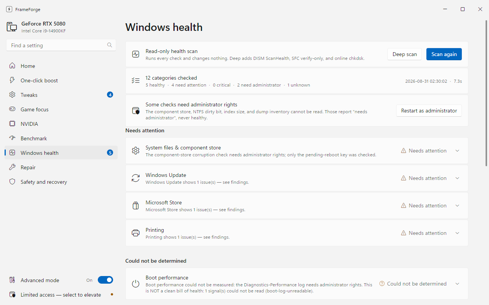
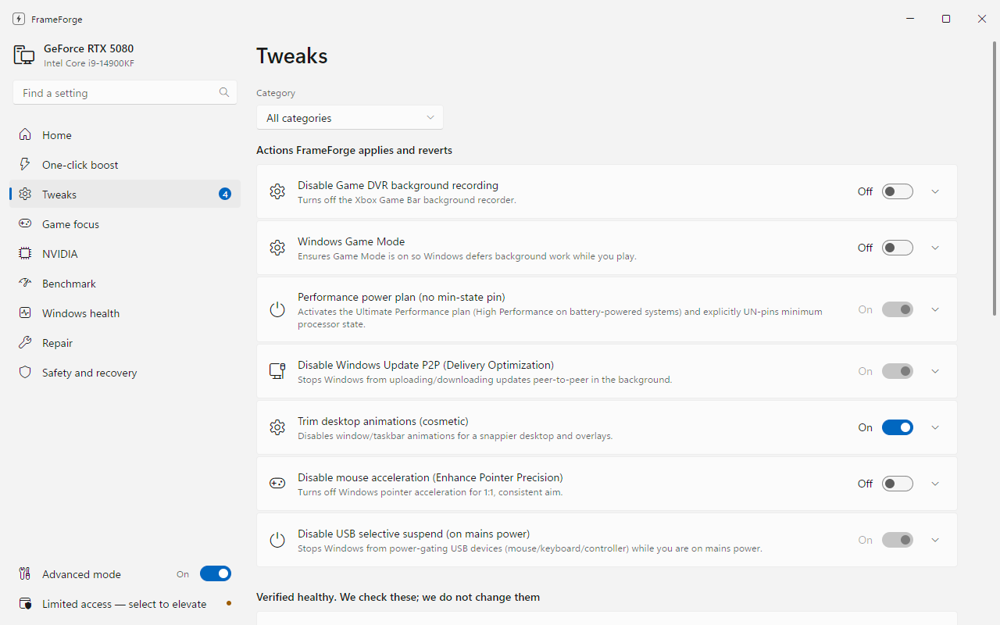
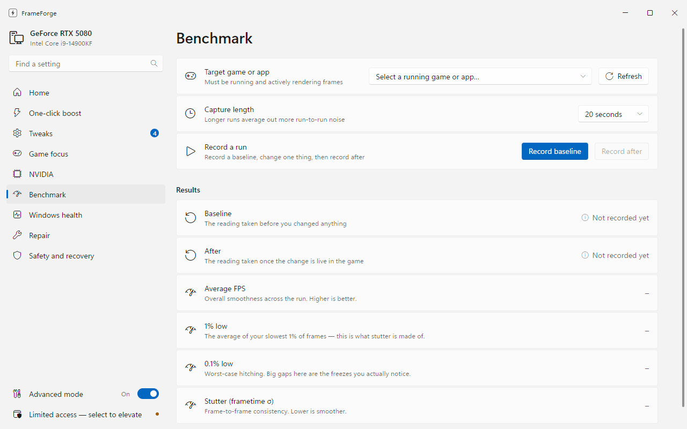
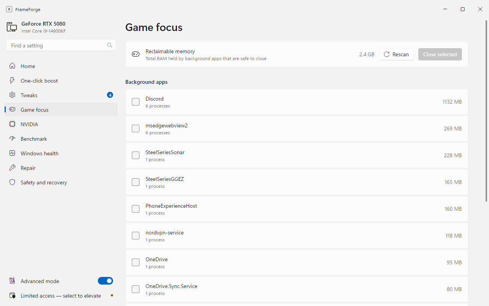
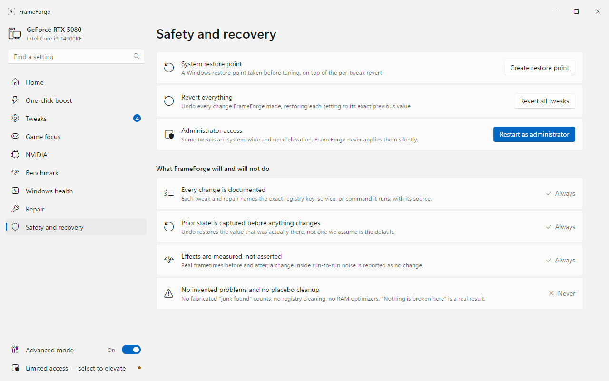

# FrameForge

**Diagnose, repair and tune Windows. Measure it. Prove it.**

FrameForge is the anti-snake-oil PC tool. It does two jobs and applies the same rule to both:
**never claim something it did not measure.**

- **Repair Windows.** 12 read-only health checks and 28 repairs covering Windows Update, the
  component store, disk and file-system health, networking, the Store, search, printing, audio and
  more — up to reinstalling Windows over a broken install while keeping your apps and files. Every
  repair detects the problem first, names the exact commands it will run, and re-runs the same check
  afterwards to see whether it actually worked.
- **Tune for FPS.** Reversible, sourced optimizations proved with **real Intel PresentMon frametime
  capture** (average + 1% low + 0.1% low + stutter), never with a made-up score.

> It tells you the truth about your PC, then proves it.



---

## Why another "FPS booster"?

Most are scareware: they invent "487 errors found", "clean" your registry (which does nothing for
FPS and can break Windows), run an always-on "RAM booster" (which *causes* stutter), and bundle
adware. FrameForge is the opposite:

- **Transparent** — each tweak shows its exact `HKLM\...` key / `powercfg` GUID / service name.
- **Reversible** — a JSON backup ledger records the prior value (and whether the key even existed)
  before every change. `Revert Everything` restores your system precisely.
- **Measured** — the Benchmark tab captures real frametimes with [Intel PresentMon](https://github.com/GameTechDev/PresentMon)
  and shows before/after with proper percentile metrics.
- **Honest** — placebo tweaks are left out on purpose (see *What it refuses to do*), and cosmetic /
  verify-only items are grouped separately so they never inflate an "optimizations applied" count.
- **Hardware-aware** — it fingerprints *your* rig and surfaces the highest-value real wins for it.

The repair half is held to the same standard, and it is where most "PC fixer" tools fail hardest:

- **It diagnoses before it repairs.** A repair refuses to run when nothing is broken. *"Nothing is
  broken here"* is a result, not an error.
- **It verifies afterwards** by re-running the same read-only check, and distinguishes *"every step
  ran"* from *"the problem is actually gone"*.
- **It says when it could not tell.** A check that was denied, timed out, or returned something
  unrecognised reports exactly that. It never renders a failed measurement as a clean bill of health.
- **Undo restores what was actually there**, captured before the change — not a hardcoded guess at
  the Windows default. Caches are renamed with a timestamp rather than deleted, so even the
  irreversible repairs leave a recovery path.
- **The heavy rungs are consent-gated.** Reinstalling Windows shows you the exact command, what is
  preserved, how long it takes, how many reboots, and the rollback window — and does nothing until
  you agree.

The FPS half is tuned for the author's rig (**i9-14900KF · RTX 5080 · 32GB DDR5 · 1920×1080 @ 241Hz**);
the repair half is general-purpose.

---

## Features

| View | What it does |
|---|---|
| **Dashboard** | Live hardware detection, an honest optimization score, and a prioritized list of *detected opportunities* (e.g. XMP is off → the #1 free win on this rig). |
| **One-Click Boost** | Curated, reversible profiles — *Safe Boost*, *Competitive*, *Maximum* — plus *Revert Everything*. |
| **Tweaks** (Advanced) | Every individual optimization, grouped into **Actions** (we apply/revert), **Verified healthy** (we check, we don't change), and **Advisories** (BIOS/in-game — we guide you). Each row shows tier, impact, risk, and the exact change. |
| **Benchmark** | Records real frametimes via PresentMon and shows Average FPS, 1% low, 0.1% low and stutter, with a Baseline → After A/B comparison and live deltas. |
| **Game Focus** | Lists background apps that steal CPU/RAM/GPU-encoder time (Discord, NordVPN, SteelSeries, OneDrive…) and closes the ones you pick. System-critical and anti-cheat processes are never listed. |
| **NVIDIA** | Dedicated competitive-tuning tab (see below). |
| **Windows health** | 12 read-only diagnostic categories in ~7 seconds — system files, disk, Windows Update, network, Store, search, printing, crash history, disk space, boot time, audio, activation. Checks it could not run without elevation are grouped as *could not be fully checked*, never as healthy. |
| **Repair** | The repair ladder, with each repair's live detection state. **Preview** dry-runs anything and prints the literal commands. Shows the ledger of what was changed and offers undo where the repair is reversible. Includes the consent-gated fresh-image repair. |
| **Safety & Revert** | One-click System Restore point, full revert, elevation, and the no-snake-oil pledge. |

### NVIDIA tab — competitive driver tuning (judged + verified)

A dedicated tab built from a 14-agent workflow (research → 3 designs → 4-lens judge panel → synthesis;
plan in `docs/NVIDIA-TAB-PLAN.md`). The reliability crux is solved by **`-createCSN`**: FrameForge
dumps the authoritative SettingID→value map *from your exact driver* and derives every code from it, so
nothing is ever blind-written (the bundled `nvidiaProfileInspector` has no headless export, and the
research's hardcoded decimals were frequently wrong — e.g. V-Sync Force On is `0x47814940`, verified live).

- **Status strip** — driver version, a hard **restore-point gate** (no Apply until a DRS snapshot exists),
  a **G-SYNC/VRR** toggle, "Open tuner", and a persistent **ban-safe shield** (driver config, not injection).
- **Three preset cards** — *Esports / Lowest Latency*, *Balanced* (recommended; tear-free, **VRR-gated** —
  auto-degrades to the Esports sync model if no VRR), *Quality*. Honest qualitative impact chips (never a
  fabricated ms/FPS number) and a "See exactly what changes" diff sheet.
- **Apply / revert engine** — generates a `.nip` (per-game profiles for your detected titles + a flagged
  Base Profile), applies via `-silentImport`, and reverts via the **full DRS snapshot** (exact rollback).
  Verified end-to-end on the real RTX 5080 driver (apply exit 0, snapshot revert restores all files).
- **Do-it-in-game checklist** — Reflex / Reflex 2 / **"DLSS MFG = OFF for competitive"** — because these are
  per-title engine flags, not driver values, FrameForge guides them rather than faking a toggle.
- **Advanced (transparent) view** — every setting with an impact badge (REAL LATENCY / CONSISTENCY /
  ANTI-STUTTER / INSURANCE), tier, recommended value, scope, and its **verified SettingID**.
- **Placebo drawer** — Texture-Filtering-High-Perf, Threaded-Optimization-Off (flagged *harmful* on the
  8P+16E 14900KF), CUDA P2, Negative LOD (anti-cheat scrutiny) — shown read-only with reasons, never shipped.

### NVIDIA settings — snapshot & tune (the honest way)

FrameForge bundles [`nvidiaProfileInspector`](https://github.com/Orbmu2k/nvidiaProfileInspector) (open source) but
**deliberately does not blind-write driver setting values** — their numeric IDs/encodings are
version-sensitive, and writing them unverified to your live driver is exactly the kind of
"trust me" change this app rejects. Instead it does the verifiably-correct thing:

- **Snapshot NVIDIA settings** — copies your entire driver profile database
  (`%ProgramData%\NVIDIA Corporation\Drs\nvdrsdb*.bin`) to a timestamped restore point. A clean
  snapshot of *all* your NVIDIA settings before you touch anything — something almost no tool offers.
- **Open NVIDIA tuner** — launches the proven GUI where every setting (Power Management = Prefer Max
  Performance, Texture Filtering = High Performance, Shader Cache, etc.) is a *named dropdown*, so you
  see exactly what you're changing.
- **Restore last snapshot** — copies the saved database back (reboot to reload the driver). Exact,
  complete restoration of whatever you had — no orphaned per-game profiles.

Reflex stays an in-game advisory because it's a per-title toggle, not a driver-profile value — and
it's the real latency win regardless.

<p align="center">
  
  
</p>
<p align="center">
  
  
</p>

---

## The catalog (what it actually changes)

Every item is sourced. **Actions** are applied and reverted by FrameForge; **Verify** items are
read-only health checks; **Advise** items are BIOS/in-game steps it guides you through but never
does silently.

### Actions
| Tweak | Impact | What & why |
|---|---|---|
| Disable Game DVR | medium | Stops the Xbox background recorder stealing GPU-encoder time — one of the most reliable measurable wins. |
| Windows Game Mode | low | Defers background work (Update installs, defrag) while you play. |
| Performance power plan (**no min-state pin**) | low | Ultimate Performance to drop core-parking latency, **but min processor state is left at 5%, not pinned to 100%** — pinning it raises the idle voltage floor, the exact condition behind Raptor Lake Vmin-shift aging. |
| Disable Windows Update P2P | medium | Turns off Delivery Optimization peer seeding that hogs bandwidth/CPU mid-game. |
| Disable mouse acceleration | situational | Turns off Enhance Pointer Precision for 1:1, consistent aim (input feel, not FPS). |
| Disable USB selective suspend | low | Stops Windows power-gating idle USB devices; removes input-device wake hitches. Records/restores prior AC+DC values. |
| Trim desktop animations | low (cosmetic) | Snappier Alt-Tab/overlays; honestly tagged cosmetic — negligible in-game FPS. |

### Verified healthy (read-only)
| Check | Why |
|---|---|
| Hardware-Accelerated GPU Scheduling | Required for the Reflex / DLSS Frame-Gen low-latency path. |
| Raptor Lake microcode | Confirms the 0x12B+ Vmin-shift mitigation (this rig reads **0x133** ✓). |
| Receive Side Scaling | NIC interrupts spread across cores (only flagged if positively disabled). |

### Advisories (BIOS / in-game)
| Advisory | Impact | Note |
|---|---|---|
| Intel Default Settings power profile | high | Do **first** — protects the CPU before any memory OC. |
| Enable XMP (DDR5 5600) | high | The single biggest free CPU-bound FPS lever here (running 4800 of rated 5600). Do **after** Intel Default Settings. |
| Resizable BAR | medium | Verify enabled in the NVIDIA App / BIOS. |
| Enable NVIDIA Reflex in-game | high | The real latency win (20–40 ms) — beats any registry tweak. |
| Use wired 2.5G Ethernet | high | Already satisfied on this rig (Intel I225-V, wired). |
| Move active games to the 980 PRO | medium | Data-driven: FrameForge maps each Steam library to its physical disk and flags games stuck on the QLC 860 QVO. On this rig all 12 games are already on the 980 PRO NVMe, so it reports *satisfied* rather than nagging. |
| Disable Nagle (TCP games only) | situational | Advise-only — useless for UDP shooters, fragile per-interface edit. |

---

## What it refuses to do (validated placebo / harmful)

These are deliberately **not** in FrameForge, because the evidence says they are placebo or dangerous:

- ❌ Registry "cleaning"/"optimization" — zero FPS, can break Windows Update/boot.
- ❌ Fabricated error counts / scare scores — the defining scareware tactic.
- ❌ `NetworkThrottlingIndex = 0xFFFFFFFF` — can *worsen* DPC latency; keep the default 10.
- ❌ MMCSS "Games" GPU Priority / SFIO Priority — Microsoft docs say these fields are *"not used."*
- ❌ Pinning minimum processor state to 100% on this 14900KF — raises the aging-linked idle voltage floor.
- ❌ Disabling C-states / forcing HPET / `useplatformclock` / `disabledynamictick` — hurts Raptor Lake.
- ❌ `TdrDelay` edits — that's a crash-recovery watchdog, not a perf lever.
- ❌ `LargeSystemCache` — a file-server setting that steals RAM from games.
- ❌ DNS-change-for-ping, disabling interrupt moderation — out of the gameplay path / microsecond noise.
- ❌ Always-on "RAM cleaners" — `EmptyWorkingSet` forces re-faults = *more* stutter.
- ❌ Affinity/priority on kernel-anti-cheat games (Vanguard/EAC/BattlEye) — ban risk; hard-gated.
- ❌ Setting games to REALTIME priority — starves input/audio/DPC threads.
- ❌ Disabling UAC or boot-critical/security services for "latency".

---

## Architecture

```
electron/        Electron main process (frameless window, tray, secure IPC, elevation)
  main.js        spawns the PowerShell engine, exposes IPC, capture-to-PNG dev hook
  preload.js     contextBridge — the minimal, sandboxed window.ff API
src/             Renderer (vanilla HTML/CSS/JS — no build step, fast & auditable)
  index.html  styles.css  app.js
engine/          The PowerShell engine — single source of truth for system work
  _lib.ps1       shared helpers (single-JSON emit, event/eventlog access, OS + capability probes)
  sysinfo.ps1    read-only hardware + state detection (emits JSON)
  engine.ps1     transactional apply/revert with a backup ledger (detect/apply/revert/revert-all/restore-point)
  health.ps1     12 read-only diagnostic categories (scan / probe / deep)
  repair.ps1     28 repairs: detect -> fix -> verify, state-capture ledger, undo, selftest
  image.ps1      fresh Windows image repair (detect / validate / dism-source / preflight / consent / launch / verify)
  compat.ps1     compatibility self-check — what this build can and cannot do on THIS machine
  measure.ps1    PresentMon wrapper + reviewer-grade metric math (avg / 1% / 0.1% low / stutter)
  procs.ps1      window/bloat process helpers for Benchmark + Game Focus
  test/          the automated engine suite (mock-driven; see Running it)
tools/vmtest/    Hyper-V matrix harness: provisions guests, breaks Windows on purpose, checks the repair notices
data/
  tweaks.json    the declarative, sourced catalog (UI is a pure view over this)
  health-checks.json  what each diagnostic reads, in plain English, and which repairs address it
  repairs.json   the repair catalog — every command each repair runs, its reversibility and risks
  image-repair.json / compat.json  fresh-image flow copy, and compat-check explanations
resources/
  PresentMon.exe Intel PresentMon 2.4.1 (MIT) — the measurement engine
```

The UI is a **pure view over `data/tweaks.json`** — Simple and Advanced modes share one source of
truth, and adding a tweak is a data edit, not a code change. All privileged work is isolated in the
PowerShell engine; the renderer has no Node access (`contextIsolation`, no `nodeIntegration`).

---

## Installing it

Grab **[FrameForgeSetup.exe](https://github.com/aaljarrah/fps-booster/releases/latest/download/FrameForgeSetup.exe)**
from the latest release and run it. One click: it installs per-user (no admin prompt), puts
FrameForge in the Start Menu, and launches when it finishes. Installed copies check GitHub on
launch and update themselves silently when they quit. Uninstall from Windows Settings → Apps;
your rollback ledger in `%LOCALAPPDATA%\FrameForge` survives both updates and reinstalls.

Every release artifact is Authenticode-signed — installer, app, uninstaller, and each
PowerShell engine script (which keeps the engines alive under `AllSigned` execution-policy
GPOs). Verify a download against the `SHA256SUMS.txt` on its release page. Signing details
and the production-certificate swap: [docs/signing.md](docs/signing.md).

To build the installer yourself: `npm run dist` → `dist/FrameForgeSetup.exe` (signs with a
local dev certificate unless you provide one).

## Running it from source

```powershell
# from the project root
npm install      # already done — installs Electron
npm start        # launches FrameForge
```

A **FrameForge** shortcut is also in the Start Menu. Many tweaks (HKLM, power plans, services) need
elevation — launch normally, then click **Restart as administrator** (or **Limited — click to elevate**
in the sidebar). Frametime capture also requires admin (PresentMon uses ETW).

Engine self-tests:
```powershell
npm run test:engine                                                    # the automated engine suite
powershell -NoProfile -File engine/compat.ps1 -Action check            # what works on THIS machine
powershell -NoProfile -File engine/health.ps1 -Action scan             # read-only health scan
powershell -NoProfile -File engine/repair.ps1 -Action selftest         # catalog/engine contract check
powershell -NoProfile -File engine/engine.ps1 -Action detect-all       # read all tweak states
powershell -NoProfile -File engine/measure.ps1 -Action metrics -Frametimes "10,10,10,100"
```

Nothing above changes the machine. To see what a repair *would* do without running it:

```powershell
powershell -NoProfile -File engine/repair.ps1 -Action run -Id wu-reset -DryRun
```

---

## Supported environments (and what that is based on)

FrameForge targets **English-language Windows 11** (21H2 through 25H2), x64, Home or Pro.

What that claim rests on, stated plainly:

- **Validated by execution** on one machine: Windows 11 Pro 25H2 (26200), en-US, x64 desktop, NVMe,
  NVIDIA, non-domain. Read-only diagnostics, every repair's dry-run, detection across the whole
  catalog, and the app itself have all been exercised there.
- **Validated by the automated suite** under simulated conditions the dev box cannot provide: other
  editions and builds, absent cmdlets, missing services, denied reads, empty and oversized event logs.
- **Not yet validated by execution:** repairs actually running. Exactly one repair (`shell-restart`,
  the safest in the catalog) has ever executed for real. The rest are proven not to fire when they
  shouldn't, and proven to describe themselves accurately, but have not been proven to fix anything.
  `tools/vmtest/` exists to close that gap in throwaway VMs, and has not been run.
- **Degraded, not supported, on localized Windows.** A few checks read English text from command
  output as their last resort. Where that fails, they report that they could not determine the
  answer rather than guessing — the right failure direction, but a worse experience.
- **Known to be unusable** where Group Policy enforces an AllSigned/Restricted PowerShell execution
  policy, or under WDAC/AppLocker ConstrainedLanguage. The app detects these and says so rather than
  failing silently.

Run `engine/compat.ps1 -Action check` on any machine for a truthful per-capability report for it.

---

## How it was tested

- **Engine** — apply→verify→revert roundtrips proven to restore exact prior state, *including removing
  keys that did not exist before*; multi-tweak ledger persistence; `revert-all`; elevation-gating;
  dry-run no-op; advisory/verify paths. The power-plan switch (High Performance ↔ Ultimate ↔ back)
  was exercised end to end.
- **Measurement** — metric math validated against hand-computed expectations (steady frames → 0
  stutter; a single 100 ms frame → exact 1%-low and σ), plus PresentMon CSV parsing.
- **Detection** — caught a real-world gotcha: WMI mis-reported the display as 1440p@59Hz; the
  authoritative `EnumDisplaySettingsW` API (via `[NullString]::Value`) correctly reads **1080p@241Hz**,
  so FrameForge shows *no* false "raise your refresh rate" recommendation.
- **UI** — every view driven and asserted in a live render: dashboard accuracy, profile apply
  (score 47→79) and revert (→47), kind-based tweak grouping, the A/B benchmark deltas, and Game Focus
  selection. The screenshots above are captured from the real app against this machine's real data.
- **Elevated live run (real hardware)** — with administrator rights, the admin-gated paths were
  exercised end-to-end on the live machine and **fully reverted**: `delivery-optimization-off`
  (`DODownloadMode 0` → removed), `usb-selective-suspend-off` (AC index `0x0` → `0x1`), and the
  power-plan switch. A **real PresentMon capture** of a ~240fps present stream produced
  `1196 frames, avg 240.8 FPS, 1% low, 0.1% low, stutter 0.64 ms` — matching the 241Hz panel. NVIDIA
  snapshot→restore round-tripped (`ok, needsReboot`). This run caught **two real bugs** that unit
  tests couldn't: PresentMon's console text (`"Started recording."`) leaking into stdout and breaking
  the caller's JSON parse (fixed by redirecting the child's output), and a PowerShell single-element
  array unwrap that made the NVIDIA restore index a string character instead of the snapshot name
  (fixed with `@()`). Afterward the machine was confirmed byte-for-byte back to its original state.

### The repair and health engines (v0.2)

These are newer than the tweak engine above and their testing status is different. Stated plainly so
nobody mistakes design confidence for evidence:

- **Proven by execution:** the 12-category health scan against real machine state; detection across
  all 28 repairs; every repair's dry-run (each verified to mutate nothing, with the printed commands
  matching the catalog); refuse-when-healthy; refuse-when-the-probe-itself-failed; the consent
  contracts; `selftest`; and the app rendering all screens against the live engines.
- **Proven by the automated suite** under simulated conditions: other editions and builds, absent
  cmdlets, missing services, denied reads, unparseable and oversized inputs.
- **Not proven:** repairs actually repairing. Exactly one repair has ever executed for real
  (`shell-restart`). The rest are proven not to fire when they shouldn't and to describe themselves
  accurately, but not proven to fix anything. `tools/vmtest/` was built to close this in throwaway
  VMs and has not been run.
- **Found by adversarial review, not by testing:** every round of blind review found defects that
  reading the code had missed — a repair that reported success while silently doing nothing about the
  finding it claimed to fix; a catalog that claimed its command list was verified when the check only
  counted lines; a probe stating "no stuck print jobs" after its API threw; an unreadable build
  number becoming `build 0`; and a screenshot harness that silently reused frames, producing evidence
  that misrepresented the app. The review record is in `docs/GAUNTLET.md`.

---

## Roadmap (honest about what's next)

- ✅ **NVIDIA one-click apply** — *done*: preset cards + per-setting custom apply generate a `.nip` of
  live-verified settings and import it via `-silentImport`, snapshot-gated and exactly revertable.
- ✅ **Per-machine catalog** — *done*: ships a driver-independent template and regenerates the concrete
  setting IDs/codes from `-createCSN` on the user's actual driver (with a re-verify banner on driver
  mismatch and a display-adaptive frame cap); unresolvable settings are disabled, never blind-written.
- ✅ **Measure-it A/B** — *done*: per-row hook into the Benchmark tab with an honest
  "within margin of error" verdict.
- ✅ **Windows health + repair** — *done*: 12 read-only diagnostics and 28 repairs, each detecting
  before it acts and verifying after, with a state-capture ledger and undo where reversible.
- ✅ **Fresh-image repair** — *done*: consent-gated in-place reinstall that keeps apps, files and
  settings, with media matching, a lighter component-store rung first, and post-repair verification.
- **Run the VM matrix.** `tools/vmtest/` is built but has never run; Hyper-V is installed on the dev
  box pending a reboot. This is the single highest-value gap — it is what turns "the repairs are
  proven not to misfire" into "the repairs are proven to work."
- **Per-game profiles** with an anti-cheat gate (already designed: never touch Vanguard/EAC/BattlEye).
- **Automated game-library / shader-cache relocation** off the QLC SATA SSD.
- **Code signing (EV cert)** — an unsigned elevated tweaker trips SmartScreen/Defender; signing is a
  real launch requirement, not an afterthought.

---

## License

MIT. Bundles Intel PresentMon (MIT). Not affiliated with Intel, NVIDIA, or Microsoft.
